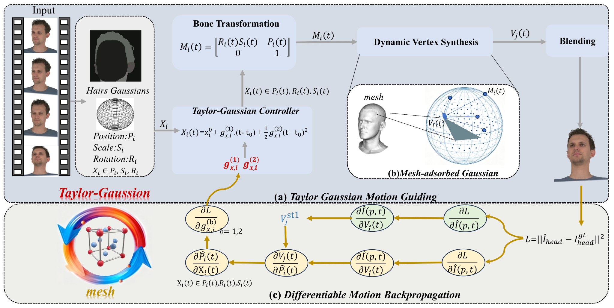

# TGMF: Taylor Gaussian Motion Field for Dynamic Head Avatars

**Xiangyang Wang, Yu Qiu, Xiao Tan, Rui Wang\*, Senior Member, IEEE, Erkang Cheng**

School of Communication and Information Engineering, Shanghai University, Shanghai 200444, China  
(e-mail: wangxiangyang@shu.edu.cn; qiuyu06@shu.edu.cn; 1169080163@shu.edu.cn; rwang@shu.edu.cn)

Nullmax Co., Ltd., Shanghai, China  
(e-mail: twokang.cheng@gmail.com)

**Corresponding author:** Rui Wang

---

## ✅ Status

- [x] Project page is online.
- [x] Framework figure is available in this repository.
- [x] Demo video for the current subject is available.
- [ ] Paper PDF link will be added.
- [ ] Code release will be added.
- [ ] Demo videos for 8 additional subjects will be added.

## Framework

  

  <em>Overview of TGMF. The method models Gaussian motion with a second-order Taylor field and improves temporal consistency through bidirectional Gaussian--mesh optimization.</em>

## Demo Video

  

  <em>Click the preview image to open the full-resolution demo video.</em>

## Abstract

3D Gaussian Splatting has recently enabled high-quality head avatar reconstruction and animation. However, existing dynamic head-avatar methods usually rely on fixed Gaussian--mesh bindings or implicit deformation networks that do not explicitly model the geometric relationship between local Gaussian motion and global mesh deformation. As a result, they remain prone to local distortion, temporal blur, and drift under large expressions or rapid head motion. This paper proposes Taylor Gaussian Motion Field (TGMF), a locally continuous dynamic field that parameterizes motion-related Gaussian attributes using a second-order Taylor formulation around a reference state. Rather than treating motion as a frame-conditioned black-box mapping, TGMF explicitly associates Gaussian evolution with interpretable velocity and acceleration coefficients, yielding a compact, differentiable, and physically meaningful representation of local dynamics. To couple local Gaussian motion with global head geometry, we further introduce a unified affine motion formulation and a mesh-coupled optimization strategy that allows Gaussian trajectories to drive mesh deformation while using mesh reconstruction errors to refine the Gaussian motion field through bidirectional feedback. This design improves temporal consistency without sacrificing local flexibility in highly dynamic regions such as hair boundaries and facial contours. Experiments on NeRSemble show that TGMF achieves stronger rendering fidelity than publicly reproducible baselines in both novel-view synthesis and self-reenactment, while producing smoother and more stable dynamic motion.

## Contact

For questions about this project, please contact **Rui Wang** or **Xiao Tan** through the affiliations and email addresses listed above.
